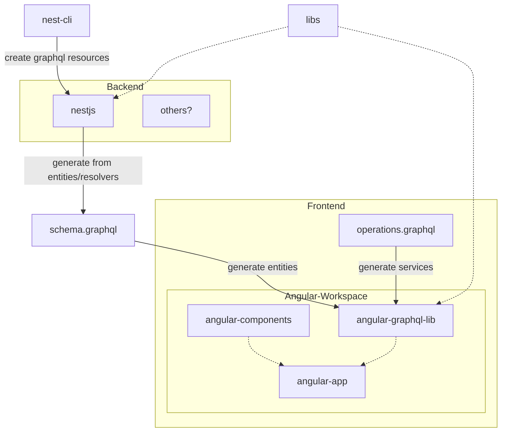

# solution-fullstack-starter

## 代码架构


```mermaid
flowchart TB
  libs

  subgraph Frontend
    subgraph Angular-Workspace
      angular[angular-graphql-lib]
      angular-app
      angular-components -.-> angular-app
      angular -.-> angular-app
    end
    operations.graphql
  end

  subgraph Backend
    nestjs
    others?
  end
  nest-cli -- create graphql resources--> nestjs
  nestjs -- generate from entities/resolvers --> schema.graphql

  schema.graphql -- generate entities --> angular
  operations.graphql -- generate services --> angular

  libs -.-> nestjs
  libs -.-> angular

```

## 技术栈/工具

- pnpm
- <https://www.graphql-code-generator.com/>

## Develop

```bash
# install
pnpm install

# dev
pnpm all:dev
```
